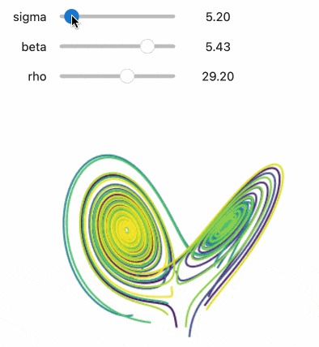

# Jupyter Widgets

```{note}
This documentation is for `ipywidgets` 8. See the [changelog](./changelog.md) for what is new and the [user migration guide](./user_migration_guides.md) for suggestions about migrating from `ipywidgets` 7.

For custom widget authors, see the [authoring migration guide](./migration_guides.md) for suggestions about how to update custom widgets to support `ipywidgets` 8.

The documentation for `ipywidgets` 7 is available at
[ipywidgets 7 documentation](https://ipywidgets.readthedocs.io/en/7.x).
```

Jupyter Widgets are [interactive browser controls](https://github.com/jupyter-widgets/ipywidgets/blob/main/docs/source/examples/Index.ipynb)
for Jupyter notebooks. Examples include:

- Basic form controls like **sliders**, **checkboxes**, **text inputs**
- Container controls like **tabs**, **accordions**, **horizontal** and **vertical layout boxes**, **grid layouts**
- Advanced controls like **maps**, **2d** and **3d visualizations**, **datagrids**, and more

Notebooks come alive when interactive widgets are used. Users can visualize and
manipulate their data in intuitive and easy ways. Researchers can easily see
how changing inputs to a model impact the results. Scientists can share
interactive results with graphical user interfaces that others can play with
without seeing code. Exploring, learning, and sharing becomes a fun immersive
experience.



## Try it online

From the _Try Jupyter Widgets Now_ sidebar, you can try `ipywidgets` in the _JupyterLab_
or _Jupyter Notebook_ interfaces, provided by [JupyterLite](https://jupyterlite.rtfd.io).

## Learning Widgets

This documentation contains a thorough description of the core Jupyter widgets
package and several examples.

There is a [video tutorial](https://youtu.be/QAtKtVcm11I) that takes a more step-by-step approach. The
Jupyter notebooks for that tutorial are [also available](https://github.com/jupyter-widgets/tutorial).

## Core Jupyter Widgets

Jupyter Widgets is primarily a framework to provide interactive controls (see
[Widget Basics](examples/Widget%20Basics.ipynb) for more information.
The `ipywidgets` package
also provides a basic, lightweight set of core form controls that _use_ this
framework. These included controls include a text area, text box, select and
multiselect controls, checkbox, sliders, tab panels, grid layout, etc.

The framework for building rich interactive objects is the foremost purpose of
the Jupyter Widgets project, and the set of included core form controls is
purposefully kept small and self-contained. We encourage and support a robust
ecosystem of packages built on top of the Jupyter Widgets framework to provide
more complicated interactive objects, such as maps, 2d and 3d visualizations, or
other form control systems built on a variety of popular Javascript frameworks
such as Material or Vue.

See the [Jupyter Widgets wiki page](https://github.com/jupyter/jupyter/wiki/Jupyter-Widgets)
for more information about custom widget packages built on top of the Jupyter Widgets
framework.

## Jupyter Widgets components

The Jupyter Widgets framework has several components:

1. A package in the _kernel_ to provide an interface for widgets. The
   `ipywidgets` Python package provides Jupyter Widgets for the IPython
   kernel. Other kernels may also provide Jupyter Widgets support.
2. An extension for the browser Jupyter frontend to manage Jupyter Widgets.
   Installing `ipywidgets` automatically installs extensions for JupyterLab
   and Jupyter Notebook (the `jupyterlab-widgets` and `widgetsnbextension`
   packages). The Jupyter Widgets project also maintains a plain HTML interface
   for embedding Jupyter Widgets on a webpage, and many other frontends support
   Jupyter Widgets.

See the
[Jupyter Widgets wiki page](https://github.com/jupyter/jupyter/wiki/Jupyter-Widgets) for more
information from the community about kernels and frontends that support Jupyter Widgets, as well as
some custom widget packages built on top of the Jupyter Widgets framework.

```{toctree}
:maxdepth: 2

tutorials/index
how-to/index
explanation/index
reference/index
```
